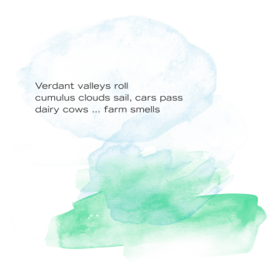
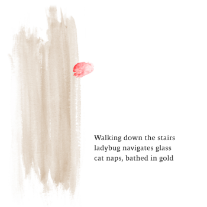
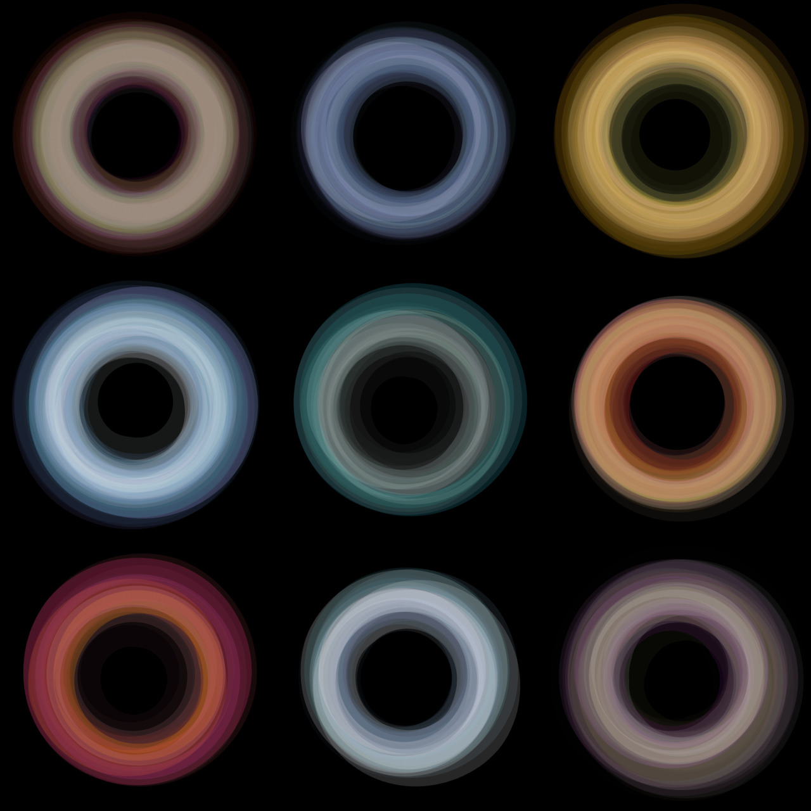
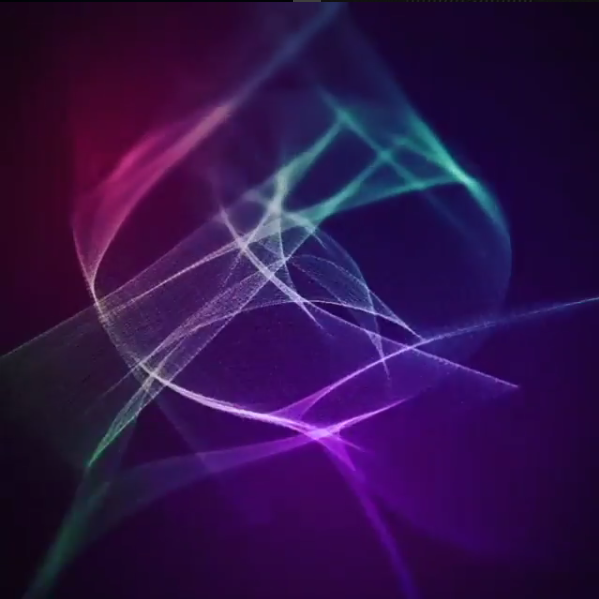
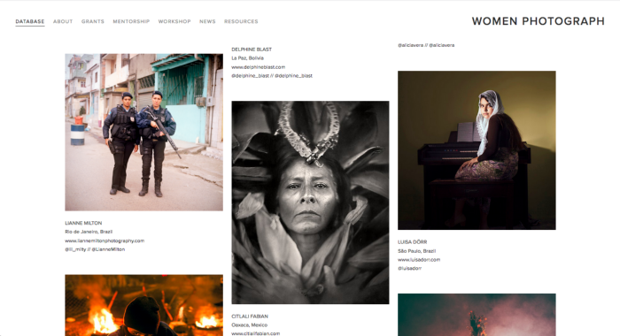
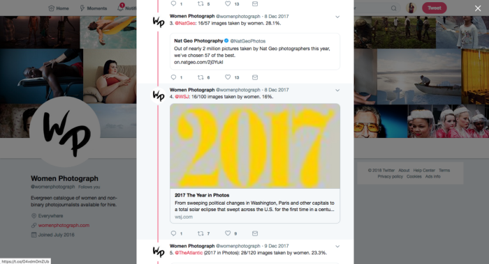
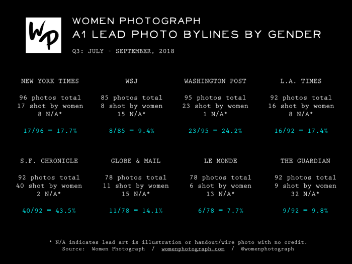

# Deb's Creative Coding Final Ideas

## 1. Poetry and Art

There was a time when I wrote poetry (or tried to) so I might like to explore what it would look like to bring them to life.

Is there a way to create a water color effect?

### Inspiration

[Image by Factor43](http://factor43.com/?works=irregular-rings)

### Inputs
MousePressed

### Outputs
Poetry changes
Watercolor design changes with poem
Random display

## 2. Musical Interaction or display with Colors and waves

[Image by NinjaCodeArtist](https://www.instagram.com/ninjacodeartist/)

### Inputs
MousePressed
MousePosition

### Outputs
Each color creates a sound
Or interrupts a pattern

## 3. Data Visualization — Women Photograph

Their website.

How they have shared the numbers. Example one above.

Example two above.

**First piece of advice: Understand the numbers, the data**

### Inputs
Unsure … Mouseover?

### Outputs
The numbers are displayed - percentages
Men vs women?
