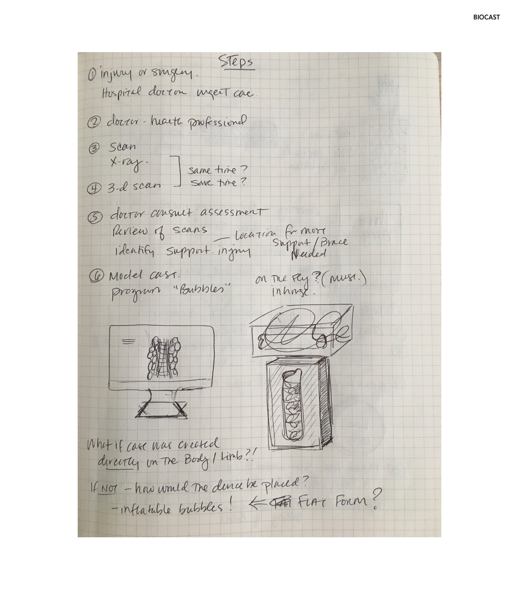
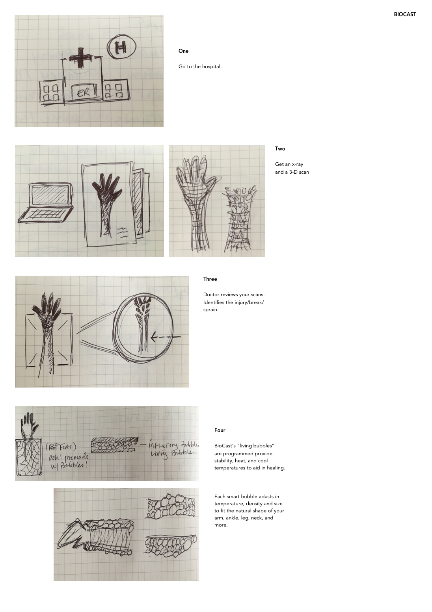

# BioCast Product and App

The **BioCast** is a product with app that provides an alternative to the cast options available for patients today.

BioCast is made of "living bubbles" that removes the discomfort of a traditional cast such as bacteria growth, swelling, pruritus, and more. The smart bubbles can also be programmed to deliver infrared heat and cooling temperatures.

It is breathable and less bulky than casts made today of plaster or fiberglass.

Through the app, patients can adjust temperature settings as needed based on their Orthopedic doctor's recommendations and their comfort level. Reminders about medication and pain management can potentially help to educate and relieve anxiety.   

### Thought Process

**[Figure 1]** A rough plan thinking about how a patient would receive a BioCast.

### Patient Journey to Get a Biocast

**[Figure 2]** A more detailed view of the events that occur after the patient visits the hospital for an injury.

**One** An injured person with a fracture, broken bone or sprain would go to the hospital. (Note: The BioCast could also be used post-surgery)

**Two** An x-ray and 3D scan would happen simultaneously to save time.

**Three** The doctor is sent the scans for review.

**Four** If it is determined the patient needs a BioCast, the "smart bubbles" are programmed to be optimized for healing and support. It is highly personalized.

The living bubbles are "alive" and mold to the shape of the person's limb or body.  

### BioCast App Interactions

**[Figure 3]** A first draft of interactions a patient would move through using the BioCast app (as a new user).

**One** Login (for first time users)

**Two** Message from your health practitioner

**Three** Checking in. How does your _arm_ feel?

**Four** Choice: Not Good. Question: Which part of your _arm_ is in pain? Please select.

**Five** Confirmation and Feedback. Plus, a reminder from the doctor (600mg of Advil)

**Six** Recommendations and Feedback on next steps

**Seven** Confirmation and visual cues.

**Eight** Status: BioCast is running smoothly. Plus, another opportunity to use reminders to manage page, doctor appointments, etc.

_Note: One thought was to add a feature where the patient could change the color of the BioCast depending on mood or fashion._
