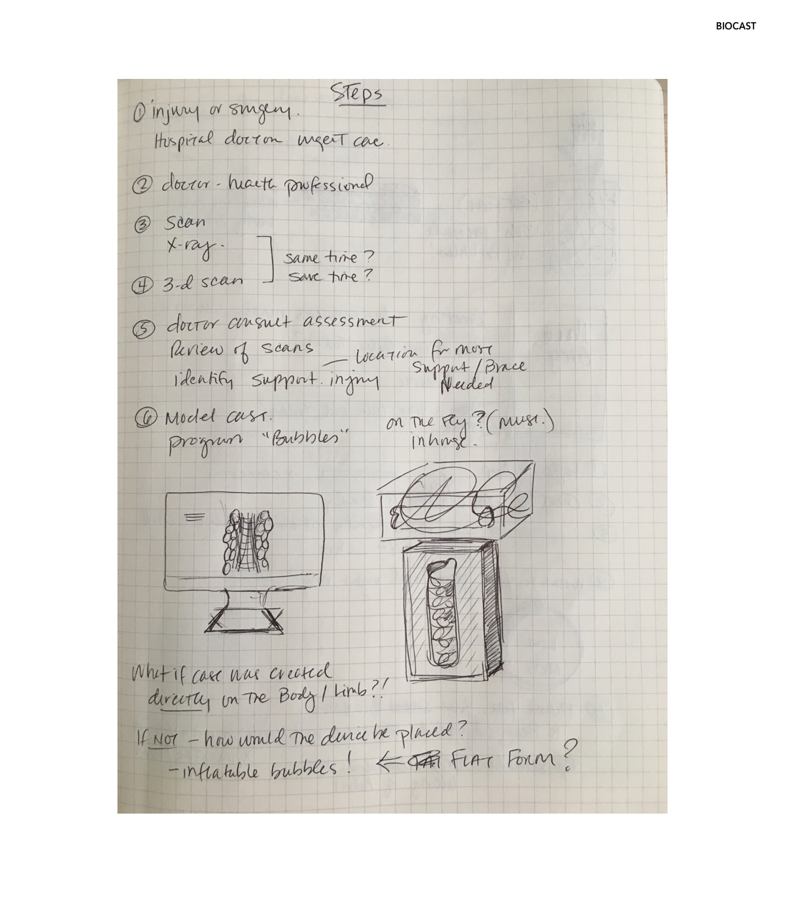
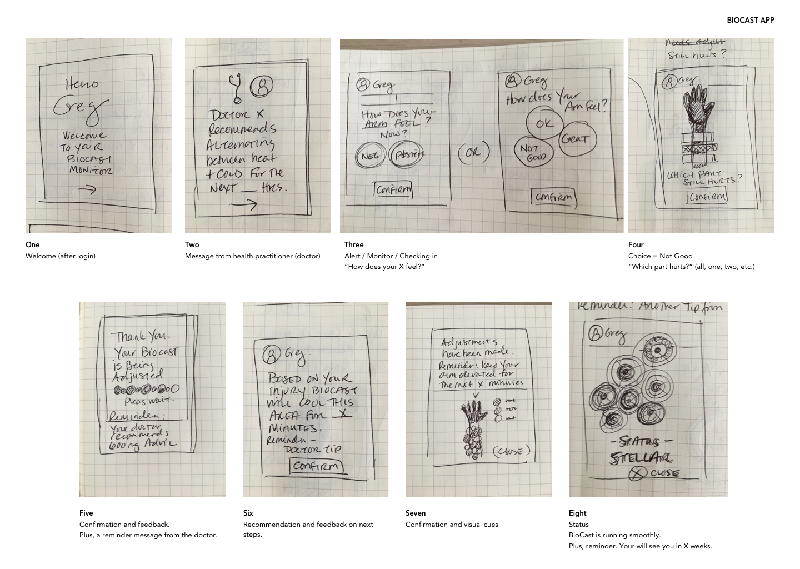

# BioCast Product and App

The **BioCast** is a product with app that provides an alternative to the cast options available for patients today.

BioCast is made of "living bubbles" that removes the discomfort of a traditional cast such as bacteria growth, swelling, pruritus, and more. The smart bubbles can also be programmed to deliver infrared heat and cooling temperatures.

It is breathable and less bulky than casts made today of plaster or fiberglass.

Through the app, patients can adjust temperature settings as needed based on their Orthopedic doctor's recommendations and their comfort level. Reminders about medication and pain management can potentially help to educate and relieve anxiety.   

### Thought Process

**[Figure 1]** A rough plan thinking about how a patient would receive a BioCast.

### Patient Journey to Get a Biocast

**[Figure 2]** A more detailed view of the events that occur after the patient visits the hospital for an injury.

### BioCast App Interactions

**[Figure 3]** A first draft of interactions a patient would move through using the BioCast app (as a new user).

_Note: One thought was to add a feature where the patient could change the color of the BioCast depending on mood or fashion._
