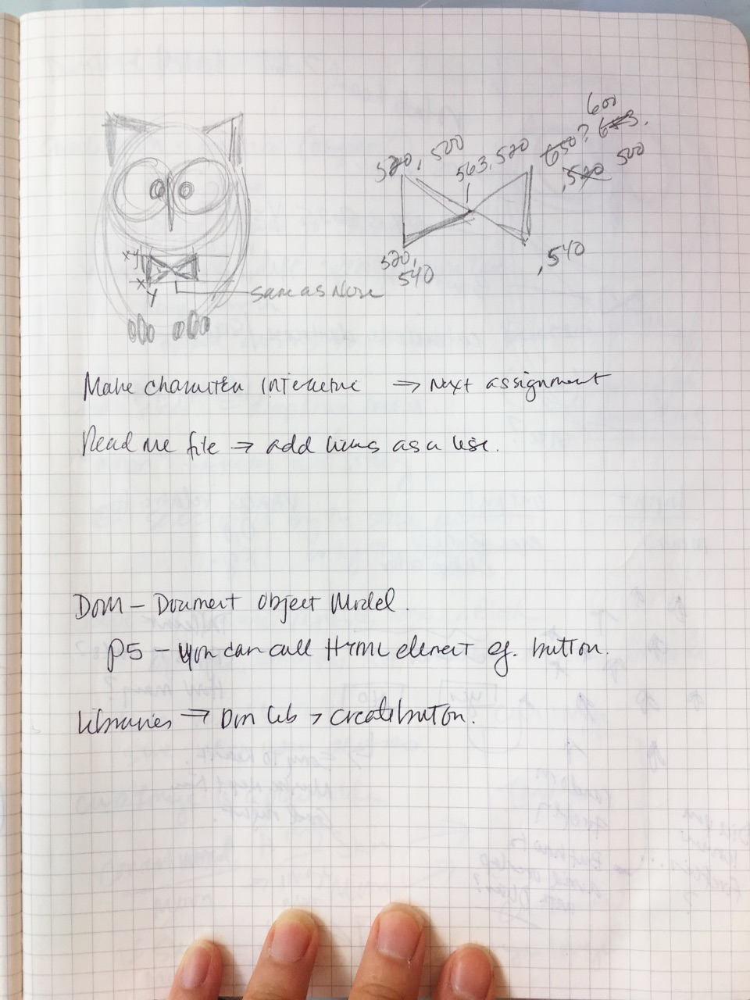
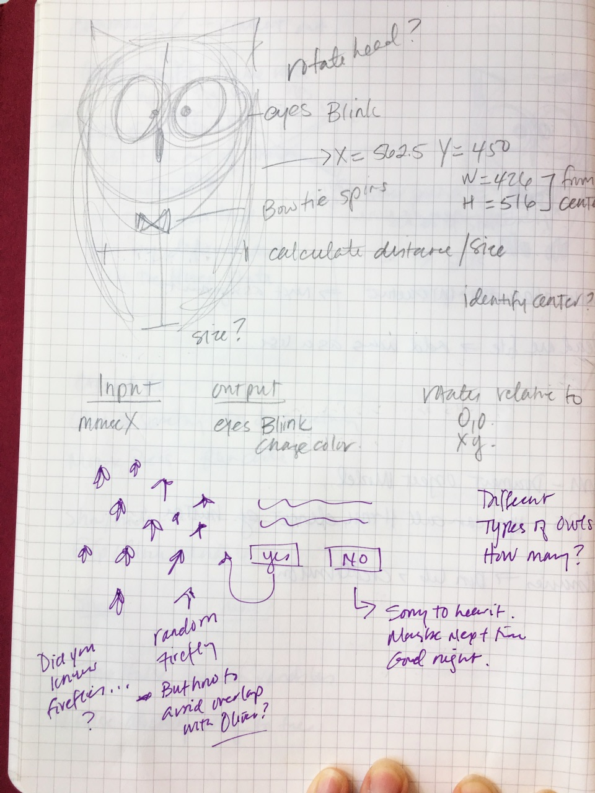
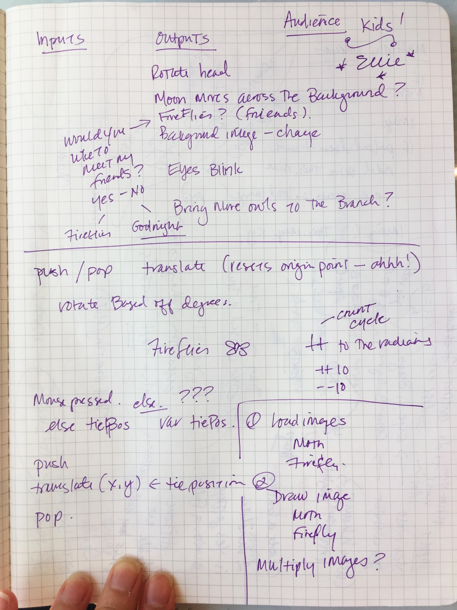
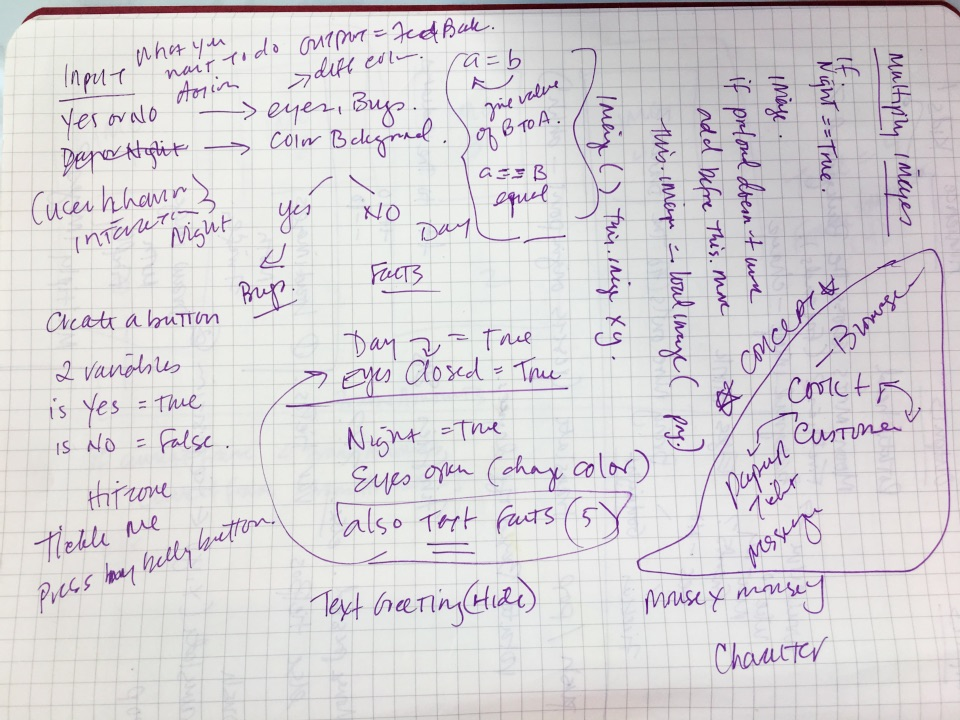

# Creative Coding Character sketch
## Oliver, the Owl

### Explanation:
    * Why are you making this project? What is your motivation?
    I love owls, always have. So I thought trying to create one from scratch on a screen would be a major accomplishment. My motivation is to learn how to code and see if I could also create something my niece would enjoy. Plus, I want to impress my nephews who are older and think their aunt is old and weird going back to school.
    * What are your inputs?
    I have several:
    ** Hit zone
    ** Key Press
    ** Mouse Press
    ** MouseY and MouseX

    * What are your outputs?
    I have several:
    ** Hit Zone: Oliver's tie rotates and his toes jiggle.
    ** Key Press: 8 Facts about owls are cycled through an array when a person presses any key.
    ** MouseX and MouseY: The fireflies follow the mouse.
    ** Buttons (Yes, No, Reset): The background changes color, fireflies show up and/or the text changes depending on the state.
    * Who is the target audience for your project?
    My niece who is five. It may be too rudimentary for her since she's one smart cookie but I think she might enjoy it for at least a few minutes.
    * Where will your project be displayed?
    I think the browser is a great place and on Github. Now that I think about it, I wonder if the functions like `mousePressed` work for iPads? It's private (mostly).

  ### Lessons Learned

  Coding takes patience; similar to learning any other language. Practice is the only way to really learn and I wish I had more time to devote to it because coding can be really fun. It's been frustrating and amazing at the same time.

  Writing things down on paper helps. Below are some of my thoughts, sketches, doodles, frustrations, etc. When it came to positioning and values for the initial drawing, mapping them out on paper was a big help.

  
  
  
  
  
